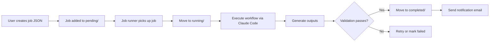

# Architecture & Automation Recommendations

**Date**: 2025-11-17
**Purpose**: Assess current implementation vs advisor feedback, recommend next steps for automation and scalability

---

## Current Implementation Status

### ✅ IMPLEMENTED (Static Site Infrastructure)

| Feature | Status | Implementation |
|---------|--------|----------------|
| **Static HTML Site** | ✅ Complete | Eleventy SSG with automatic MD → HTML conversion |
| **GitHub Repo** | ✅ Complete | This Prod repository |
| **Authentication** | ✅ Complete | HTTP Basic Auth via Cloudflare Pages Functions |
| **Auto Rebuild** | ✅ Complete | GitHub Actions with smart change detection |
| **Navigation** | ✅ Complete | Eleventy templates with file routing |
| **CSV Tables** | ✅ Complete | Auto-rendered as HTML tables + raw download |
| **Multi-user Isolation** | ✅ Complete | Per-user sites: ashish, tam, yani |

**Advisor's Goal Met**: "Convert all that to static HTML... use Cloudflare to pull/rebuild the private site" ✅

---

### ⚠️ PARTIALLY IMPLEMENTED (Data & Process)

| Feature | Status | Gap |
|---------|--------|-----|
| **Structured Data** | ⚠️ Partial | CSV files exist (LinkedIn data, investor maps) but no unified schema |
| **Output Verification** | ⚠️ Partial | `validator.md` workflow exists but runs manually, not automated |
| **Navigation** | ⚠️ Partial | Basic file routing works, but no index/hub pages or CTA surfacing |
| **Process Transparency** | ⚠️ Partial | Workflows document process, but outputs don't show "how made" |

---

### ❌ NOT IMPLEMENTED (Automation & Scalability)

| Priority | Feature | Advisor Quote | Impact |
|----------|---------|---------------|--------|
| **CRITICAL** | Automated workflow execution | "You have to run everything manually" | Blocks scaling to multiple users |
| **CRITICAL** | Output verification automation | "You have to verify everything" | Prevents hands-off operation |
| **CRITICAL** | Data/presentation separation | "Dataflow issue... md files make getting data complicated" | Limits reusability and comparison |
| **HIGH** | Workflow chaining | "Can't chain steps automatically" | Requires manual intervention between steps |
| **HIGH** | JSON-first architecture | "Export json... consolidated json data object" | Enables programmatic analysis |
| **MEDIUM** | Queuing mechanism | "Add queuing mechanism... avoid maxing tokens" | Required for multi-user access |
| **MEDIUM** | Email integration | "Hook Claude to emails... email back results" | Improves UX for non-technical users |
| **LOW** | Queryable database | "Simple database that can be queried" | Future optimization |

---

## Architecture Recommendations

### Recommendation 1: Implement Data/Presentation Separation (HIGH PRIORITY)

**Current Problem**: Markdown files mix data + presentation
```markdown
# Figure AI Research Summary
**Valuation**: $39.5B
**MOIC**: 94x
Brett Adcock founded...
```

**Proposed Solution**: JSON-first, HTML presentation
```
users/tam/hyperion/
├── data/                           # Structured data (NEW)
│   ├── portfolio.json              # Master portfolio data
│   ├── claims.json                 # Claims validation data
│   ├── network.json                # Network analysis data
│   └── gp-relationships.json       # GP-company relationships
│
├── analyses/                       # Markdown analyses (presentation)
│   ├── claims-validation.md        # Renders from data/claims.json
│   └── portfolio-assessment.md     # Renders from data/portfolio.json
│
└── supporting-research/            # Evidence (unchanged)
    └── deals/...
```

**Example: `data/portfolio.json`**
```json
{
  "fund": "Hyperion Ventures Fund I",
  "research_date": "2025-01-15",
  "overall_rating": 7.5,
  "companies": [
    {
      "id": "figure-ai",
      "name": "Figure AI",
      "tier": 1,
      "valuation_usd": 39500000000,
      "moic": 94,
      "investment_date": "2023-04-01",
      "sources": [
        {
          "type": "tier3",
          "url": "https://techcrunch.com/...",
          "date": "2024-09-15",
          "claim": "Series C at $39.5B valuation"
        }
      ],
      "gp_relationships": [
        {
          "gp": "dillon-dunteman",
          "claim": "Sourced via Tamarack Global relationship",
          "verification_status": "unverified",
          "tier": 1
        }
      ],
      "red_flags": [],
      "strengths": ["tier-1-coinvestors", "bmw-deployment", "first-humanoid-in-f500"]
    }
  ],
  "gps": [
    {
      "id": "dillon-dunteman",
      "name": "Dillon Dunteman",
      "background": {
        "harvard": true,
        "vista_years": 5,
        "firmament_experience": true
      },
      "network_stats": {
        "total_connections": 1000,
        "deeptech_pct": 33,
        "harvard_alumni": 150
      }
    }
  ],
  "claims": [
    {
      "id": "claim-1-1",
      "parent": "sourcing-differentiation",
      "text": "50+ passive deeptech founder referrals per year",
      "status": "unverified",
      "tier": 1,
      "cta": "cta-005"
    }
  ]
}
```

**Benefits**:
- ✅ Programmatic comparison between funds
- ✅ Easy to generate charts/visualizations
- ✅ Can separate "fetchers/aggregators/summarizers" as advisor suggested
- ✅ Enables automated validation (check schema compliance)
- ✅ Future: Can move to SQLite database without changing workflows

**Implementation**:
1. Create `scripts/md-to-json.js` to extract data from existing MD files
2. Update workflows to output JSON + MD (JSON = data, MD = human summary)
3. Create Eleventy templates to render JSON as HTML (auto-generate tables, charts)
4. Gradually migrate existing analyses to JSON-backed format

---

### Recommendation 2: Automate Workflow Execution via Job Queue (CRITICAL)

**Current Problem**: Manual workflow execution
- User must copy/paste workflow into Claude Code
- No progress tracking across sessions
- No way to queue multiple jobs

**Proposed Solution**: Job queue + execution engine

**Architecture**:
```
users/tam/
├── jobs/
│   ├── pending/                    # Queue of jobs to run
│   │   ├── job-001-vc-research.json
│   │   └── job-002-network-analysis.json
│   ├── running/                    # Currently executing
│   │   └── job-001-vc-research.json
│   └── completed/                  # Finished jobs
│       └── job-001-vc-research.json
│
├── workflows/                      # Workflow definitions (existing)
│   └── vc-research.md
│
└── hyperion/                       # Outputs (existing)
    └── data/portfolio.json
```

**Job Definition Example**: `jobs/pending/job-001-vc-research.json`
```json
{
  "job_id": "job-001",
  "workflow": "vc-research",
  "created_at": "2025-01-15T10:00:00Z",
  "priority": "high",
  "inputs": {
    "dataroom_path": "users/tam/hyperion/dataroom/",
    "output_path": "users/tam/hyperion/",
    "priority_deals": "users/tam/hyperion/research/priority-deals.md"
  },
  "config": {
    "max_companies_tier1": 5,
    "max_companies_tier2": 9,
    "parallel_execution": true
  },
  "notifications": {
    "email": "tam@example.com",
    "slack": null
  }
}
```

**Execution Flow**:


**Implementation Options**:

**Option A: Local Execution (Simplest)**
- Run on your Mac Mini with a cron job
- `scripts/job-runner.js` polls `jobs/pending/` every 5 minutes
- Executes via Claude Code API (if available) or manual queue
- Good for: Solo use, MVP testing

**Option B: GitHub Actions (Medium)**
- Trigger workflow via PR comment or webhook
- Job definition committed to repo
- GitHub Actions runs workflow, commits results
- Good for: Small team (2-5 users), async execution

**Option C: Dedicated Server (Future)**
- Web UI to submit jobs
- Queue manager (BullMQ, RabbitMQ)
- Worker processes execute jobs
- Good for: Scaling to 10+ users

**Recommended**: Start with **Option A** (local), migrate to **Option B** when adding users

---

### Recommendation 3: Automated Output Verification (CRITICAL)

**Current Problem**: Manual verification
- `validator.md` workflow exists but runs manually
- No automated quality checks before publishing
- No CI/CD integration

**Proposed Solution**: Automated validation pipeline

**Implementation**:
```yaml
# .github/workflows/validate-outputs.yml
name: Validate Research Outputs

on:
  pull_request:
    paths:
      - 'users/*/hyperion/data/**'
      - 'users/*/hyperion/analyses/**'

jobs:
  validate:
    runs-on: ubuntu-latest
    steps:
      - name: Checkout
        uses: actions/checkout@v4

      - name: Run JSON Schema Validation
        run: node scripts/validate-schema.js

      - name: Run Quality Checks
        run: node scripts/validate-quality.js

      - name: Comment on PR
        uses: actions/github-script@v7
        with:
          script: |
            const results = require('./validation-results.json')
            github.rest.issues.createComment({
              issue_number: context.issue.number,
              owner: context.repo.owner,
              repo: context.repo.repo,
              body: `## Validation Results\n\n${results.summary}`
            })
```

**Validation Checks**:

**1. Schema Validation** (`scripts/validate-schema.js`):
```javascript
// Check portfolio.json against schema
const Ajv = require('ajv')
const ajv = new Ajv()

const portfolioSchema = {
  type: 'object',
  required: ['fund', 'research_date', 'companies', 'gps'],
  properties: {
    overall_rating: { type: 'number', minimum: 0, maximum: 10 },
    companies: {
      type: 'array',
      items: {
        required: ['id', 'name', 'tier', 'sources'],
        properties: {
          sources: {
            type: 'array',
            minItems: 1, // Every company MUST have sources
            items: {
              required: ['type', 'url', 'date'],
              properties: {
                type: { enum: ['tier1', 'tier2', 'tier3'] }
              }
            }
          }
        }
      }
    }
  }
}

const valid = ajv.validate(portfolioSchema, portfolioData)
if (!valid) {
  console.error('Schema validation failed:', ajv.errors)
  process.exit(1)
}
```

**2. Quality Checks** (`scripts/validate-quality.js`):
```javascript
// Check quality thresholds from validator.md workflow

const checks = [
  {
    name: 'Source diversity',
    check: (data) => {
      // Every company should have ≥3 sources
      const failures = data.companies.filter(c => c.sources.length < 3)
      return {
        passed: failures.length === 0,
        message: failures.length > 0
          ? `${failures.length} companies have <3 sources: ${failures.map(c => c.name).join(', ')}`
          : 'All companies have ≥3 sources'
      }
    }
  },
  {
    name: 'Tier 3 sources',
    check: (data) => {
      // Every company should have ≥1 Tier 3 (independent) source
      const failures = data.companies.filter(c =>
        !c.sources.some(s => s.type === 'tier3')
      )
      return {
        passed: failures.length === 0,
        message: failures.length > 0
          ? `${failures.length} companies lack Tier 3 sources: ${failures.map(c => c.name).join(', ')}`
          : 'All companies have independent (Tier 3) sources'
      }
    }
  },
  {
    name: 'Unverified claims',
    check: (data) => {
      const unverified = data.claims.filter(c => c.status === 'unverified')
      const pct = (unverified.length / data.claims.length) * 100
      return {
        passed: pct < 30, // Fail if >30% unverified
        message: `${pct.toFixed(0)}% of claims are unverified (${unverified.length}/${data.claims.length})`
      }
    }
  }
]

const results = checks.map(c => c.check(portfolioData))
const failed = results.filter(r => !r.passed)

if (failed.length > 0) {
  console.error('Quality checks failed:')
  failed.forEach(f => console.error(`  - ${f.message}`))
  process.exit(1)
}
```

**Benefits**:
- ✅ Catches quality issues before deployment
- ✅ Enforces standards from validator.md automatically
- ✅ Blocks PR merge if validation fails
- ✅ Documents what was checked (audit trail)

---

### Recommendation 4: Workflow Chaining via DAG (HIGH PRIORITY)

**Current Problem**: Manual chaining
- Run `deal-prioritization.md` → copy output path → run `vc-research.md` → copy output → run `validator.md`
- No dependency tracking
- No automatic re-execution when inputs change

**Proposed Solution**: DAG-based workflow orchestration

**Example Workflow DAG**:
```yaml
# users/tam/hyperion/pipeline.yml
name: Hyperion VC Research Pipeline

workflows:
  - id: deal-prioritization
    workflow: deal-prioritization.md
    inputs:
      dataroom: users/tam/hyperion/dataroom/
    outputs:
      priority_deals: users/tam/hyperion/research/priority-deals.md

  - id: vc-research
    workflow: vc-research.md
    depends_on: [deal-prioritization]
    inputs:
      dataroom: users/tam/hyperion/dataroom/
      priority_deals: ${{ outputs.deal-prioritization.priority_deals }}
    outputs:
      portfolio_json: users/tam/hyperion/data/portfolio.json
      research_summary: users/tam/hyperion/analyses/portfolio-assessment.md

  - id: claims-validation
    workflow: claims-validation.md
    depends_on: [vc-research]
    inputs:
      dataroom: users/tam/hyperion/dataroom/
      portfolio_data: ${{ outputs.vc-research.portfolio_json }}
    outputs:
      claims_json: users/tam/hyperion/data/claims.json
      validation_report: users/tam/hyperion/analyses/claims-validation.md

  - id: network-analysis
    workflow: linkedin-network-checker.md
    depends_on: [vc-research, claims-validation]
    inputs:
      linkedin_csv: users/tam/hyperion/research/people/linkedin/connections_1k.csv
      claims_json: ${{ outputs.claims-validation.claims_json }}
    outputs:
      network_json: users/tam/hyperion/data/network.json

  - id: validation
    workflow: validator.md
    depends_on: [vc-research, claims-validation, network-analysis]
    inputs:
      workflow_file: users/tam/workflows/vc-research.md
      output_location: users/tam/hyperion/
```

**Execution Engine**:
```javascript
// scripts/run-pipeline.js
const fs = require('fs')
const yaml = require('js-yaml')

async function runPipeline(pipelineFile) {
  const pipeline = yaml.load(fs.readFileSync(pipelineFile))
  const completed = new Set()
  const outputs = {}

  while (completed.size < pipeline.workflows.length) {
    // Find workflows whose dependencies are satisfied
    const ready = pipeline.workflows.filter(w =>
      !completed.has(w.id) &&
      (w.depends_on || []).every(dep => completed.has(dep))
    )

    if (ready.length === 0) break // Circular dependency or done

    // Execute ready workflows in parallel
    await Promise.all(ready.map(async (workflow) => {
      console.log(`Running ${workflow.id}...`)

      // Resolve input variables
      const inputs = resolveInputs(workflow.inputs, outputs)

      // Execute workflow (via Claude Code API or job queue)
      const result = await executeWorkflow(workflow.workflow, inputs)

      // Store outputs for dependent workflows
      outputs[workflow.id] = workflow.outputs
      completed.add(workflow.id)

      console.log(`✓ ${workflow.id} completed`)
    }))
  }
}
```

**Benefits**:
- ✅ One command to run entire pipeline
- ✅ Automatic parallelization (network-analysis doesn't wait for claims-validation unnecessarily)
- ✅ Incremental re-execution (only re-run changed steps)
- ✅ Clear dependency visualization

---

### Recommendation 5: Email Integration (MEDIUM PRIORITY)

**Current Problem**: No notifications
- User must manually check for job completion
- No way for non-technical users to submit jobs

**Proposed Solution**: Email-triggered workflows + notifications

**Inbound Email → Job Submission**:
```
From: tam@example.com
To: hyperion+vc-research@changai.bot
Subject: New VC Research: Acme Ventures

Dataroom: https://drive.google.com/...
Priority: high
```

**Email Parser** (`scripts/email-handler.js`):
```javascript
// Triggered by email webhook (SendGrid, Mailgun, etc.)
function parseEmail(email) {
  const jobType = email.to.match(/hyperion\+(.+)@/)[1] // "vc-research"

  return {
    job_id: generateJobId(),
    workflow: jobType,
    created_at: new Date().toISOString(),
    priority: email.body.match(/Priority: (\w+)/)?.[1] || 'medium',
    inputs: {
      dataroom_path: email.body.match(/Dataroom: (.+)/)?.[1]
    },
    notifications: {
      email: email.from
    }
  }
}
```

**Outbound Notification** (after job completes):
```
From: hyperion@changai.bot
To: tam@example.com
Subject: ✓ VC Research Complete: Hyperion Ventures

Your VC research job has completed successfully.

Summary:
- Overall Rating: 7.5/10 (Above Average/Strong)
- Companies Researched: 14
- Critical CTAs: 2

View full report: https://tam.pages.dev/hyperion/

Critical Actions Required:
1. Verify GP Relationships (CRITICAL) - 100% of value-add claims unverified
2. Validate Figure AI Execution (CRITICAL) - 50%+ of portfolio value at risk

---
Quality Checks: ✓ All passed
Processing Time: 8.2 hours
```

**Benefits**:
- ✅ Non-technical users can submit jobs via email
- ✅ No need to learn Claude Code interface
- ✅ Notifications keep you informed
- ✅ Email becomes "queue interface" as advisor suggested

---

## Specific Recommendations for tam/hyperion Folder

### 1. Add Data Layer (URGENT)

**Current**: Analyses mix data + narrative
**Proposed**: Extract data to JSON, keep MD as presentation

**Migration Steps**:
1. Create `users/tam/hyperion/data/` folder
2. Extract structured data from existing analyses:
   - `data/portfolio.json` ← vc-research-summary.md
   - `data/claims.json` ← claims-validation.md
   - `data/network.json` ← network-analysis.md
   - `data/timeline.json` ← objective-timeline.md
3. Update analyses to reference JSON data (e.g., "See [portfolio data](../data/portfolio.json)")
4. Add JSON rendering to Eleventy templates (auto-generate tables)

**Example**: Convert this MD...
```markdown
| Company | Valuation | MOIC | Status |
|---------|-----------|------|--------|
| Figure AI | $39.5B | 94x | Strong |
```

...to this JSON:
```json
{
  "companies": [
    {"name": "Figure AI", "valuation_usd": 39500000000, "moic": 94, "status": "strong"}
  ]
}
```

...and auto-render via template:
```njk

  <tr>
    <td>{{ company.name }}</td>
    <td>${{ company.valuation_usd | billions }}</td>
    <td>{{ company.moic }}x</td>
    <td>{{ company.status }}</td>
  </tr>

```

**Benefits**:
- ✅ Can compare Hyperion vs other funds programmatically
- ✅ Can chart data (e.g., MOIC distribution)
- ✅ Can query "show all companies with <3 Tier 3 sources"

---

### 2. Implement Automated Validation (URGENT)

**Current**: `validator.md` exists but runs manually
**Proposed**: GitHub Actions auto-validate on every commit

**Steps**:
1. Create JSON schema for portfolio.json, claims.json, etc.
2. Create `scripts/validate-schema.js` (validate structure)
3. Create `scripts/validate-quality.js` (validate quality thresholds from validator.md)
4. Add GitHub Actions workflow (`.github/workflows/validate-outputs.yml`)
5. Block PR merge if validation fails

**Example Quality Check**:
```javascript
// From validator.md: "Minimum 3 sources per company, at least 1 Tier 3"
function validateCompanySources(company) {
  if (company.sources.length < 3) {
    return {error: `${company.name} has only ${company.sources.length} sources (minimum 3)`}
  }

  const tier3 = company.sources.filter(s => s.type === 'tier3')
  if (tier3.length === 0) {
    return {error: `${company.name} has no Tier 3 (independent) sources`}
  }

  return {ok: true}
}
```

---

### 3. Create Pipeline Definition (HIGH PRIORITY)

**Current**: Manual workflow chaining
**Proposed**: `users/tam/hyperion/pipeline.yml` defines full research pipeline

**Steps**:
1. Create pipeline.yml (see DAG example above)
2. Implement `scripts/run-pipeline.js` to execute DAG
3. Add resumability (checkpoint after each step)
4. Add `npm run pipeline:hyperion` command

**Benefits**:
- ✅ One command to run entire Hyperion research
- ✅ Can re-run specific steps (e.g., only network-analysis after adding LinkedIn data)
- ✅ Clear documentation of workflow dependencies

---

### 4. Improve Navigation (MEDIUM PRIORITY)

**Current**: Flat file listing, no index
**Proposed**: Hub page + CTA surfacing (see reorg-proposal.md)

**Already covered in reorg-proposal.md** - combine with data layer:
- `index.md` renders from `data/portfolio.json` (auto-generate summary)
- `ctas/index.md` renders from `data/claims.json` (auto-extract unverified claims)
- Navigation shows real-time stats ("14/24 companies researched")

---

## Implementation Roadmap

### Phase 1: Data Foundation (Week 1-2)
**Goal**: Separate data from presentation

- [ ] Create `users/tam/hyperion/data/` folder
- [ ] Extract JSON from 4 main analyses (portfolio, claims, network, timeline)
- [ ] Create JSON schemas
- [ ] Update Eleventy templates to render JSON

**Deliverable**: `data/portfolio.json`, `data/claims.json`, `data/network.json`, `data/timeline.json`

---

### Phase 2: Automated Validation (Week 2-3)
**Goal**: Ensure quality without manual checks

- [ ] Implement `scripts/validate-schema.js`
- [ ] Implement `scripts/validate-quality.js` (codify validator.md rules)
- [ ] Add GitHub Actions workflow
- [ ] Test validation on Hyperion data

**Deliverable**: CI/CD validation pipeline

---

### Phase 3: Workflow Orchestration (Week 3-4)
**Goal**: Automate workflow chaining

- [ ] Create `users/tam/hyperion/pipeline.yml`
- [ ] Implement `scripts/run-pipeline.js`
- [ ] Add resumability (progress tracking)
- [ ] Test full pipeline on Hyperion

**Deliverable**: `npm run pipeline:hyperion` command

---

### Phase 4: Job Queue (Week 4-6)
**Goal**: Enable async execution

- [ ] Create `users/tam/jobs/` folder structure
- [ ] Implement `scripts/job-runner.js` (local execution)
- [ ] Add job status tracking
- [ ] Test with 2-3 sample jobs

**Deliverable**: Local job queue running on Mac Mini

---

### Phase 5: Email Integration (Week 6-8)
**Goal**: Email interface for job submission

- [ ] Set up email forwarding (SendGrid/Mailgun)
- [ ] Implement `scripts/email-handler.js`
- [ ] Add notification templates
- [ ] Test end-to-end (email → job → notification)

**Deliverable**: Email-triggered workflows

---

### Phase 6: Multi-User Scaling (Week 8-12)
**Goal**: Support 2-5 concurrent users

- [ ] Add queuing mechanism (prevent token limits)
- [ ] Add user isolation (quota tracking)
- [ ] Add GitHub Actions option (replace local execution)
- [ ] Add billing/usage tracking

**Deliverable**: Production-ready system for small team

---

## Critical Next Steps (This Week)

Based on advisor feedback, prioritize these 3 tasks:

### 1. Extract Data Layer from Hyperion Analyses (2-3 hours)
**Why**: "There is a big dataflow issue, having those separate .md files makes getting data complicated"

**Action**:
- Create `users/tam/hyperion/data/portfolio.json`
- Extract company data from vc-research-summary.md
- Extract claims data from claims-validation.md
- Validate JSON with schema

**Output**: Structured data that can be queried/compared

---

### 2. Automate Validation (3-4 hours)
**Why**: "You have to verify everything"

**Action**:
- Create `scripts/validate-quality.js`
- Codify rules from validator.md (e.g., "≥3 sources per company")
- Add GitHub Actions workflow
- Test on Hyperion data

**Output**: Automated quality checks

---

### 3. Create Pipeline Definition (2-3 hours)
**Why**: "You can't chain the steps automatically"

**Action**:
- Create `users/tam/hyperion/pipeline.yml`
- Map workflow dependencies (deal-prioritization → vc-research → validation)
- Implement basic `scripts/run-pipeline.js`
- Test on Hyperion

**Output**: One-command execution of full pipeline

---

## Answers to Advisor's Concerns

### "Hard to navigate through all those files"
✅ **Partially solved**: Eleventy renders to HTML with navigation
🔄 **In progress**: Reorganization proposal adds index/hub pages
⏳ **Next**: Add data layer + auto-generated summaries

### "No way to verify the output"
❌ **Not solved**: validator.md exists but manual
⏳ **Next**: Automate validation via GitHub Actions (Phase 2)

### "No protocol/format to exchange data"
❌ **Not solved**: Everything is markdown
⏳ **Next**: JSON-first architecture (Phase 1)

### "You have to run everything manually"
❌ **Not solved**: Workflows run manually in Claude Code
⏳ **Next**: Job queue + pipeline orchestration (Phase 3-4)

### "Separation between data and presentation"
❌ **Not solved**: MD files mix both
⏳ **Next**: Extract JSON layer (Phase 1)

### "You will need to use sub agents"
✅ **Already using**: vc-research.md uses Task tool for parallel company research
✅ **Already using**: Workflows spawn sub-agents for specific tasks

---

## Open Questions

1. **Job Execution**: Do you have access to Claude Code API for programmatic execution, or should we use manual queue + notifications?

2. **Database**: Do you want to migrate to SQLite database in Phase 6, or stick with JSON files?

3. **User Access**: How many users do you plan to support in 6 months? (Affects whether to use GitHub Actions vs dedicated server)

4. **Email Provider**: Do you have a preference for email integration? (SendGrid, Mailgun, AWS SES)

5. **Benchmarking**: For calibration (from reorg-proposal.md), do you have access to Craft Ventures or Basis Set datarooms?

---

## Recommended Immediate Action

**If you can only do ONE thing this week**: Implement **Phase 1 (Data Foundation)**

**Why**:
- Unblocks all other improvements
- Enables comparison between funds (huge value)
- Relatively quick (8-10 hours)
- No infrastructure dependencies

**How**:
1. Create `users/tam/hyperion/data/portfolio.json`
2. Run `scripts/md-to-json.js` to extract data from existing analyses
3. Validate schema
4. Update one analysis (portfolio-assessment.md) to render from JSON
5. Deploy to Cloudflare Pages

**Result**: You'll have structured data that can be queried, compared, and validated programmatically - addressing the advisor's biggest concern about dataflow.
