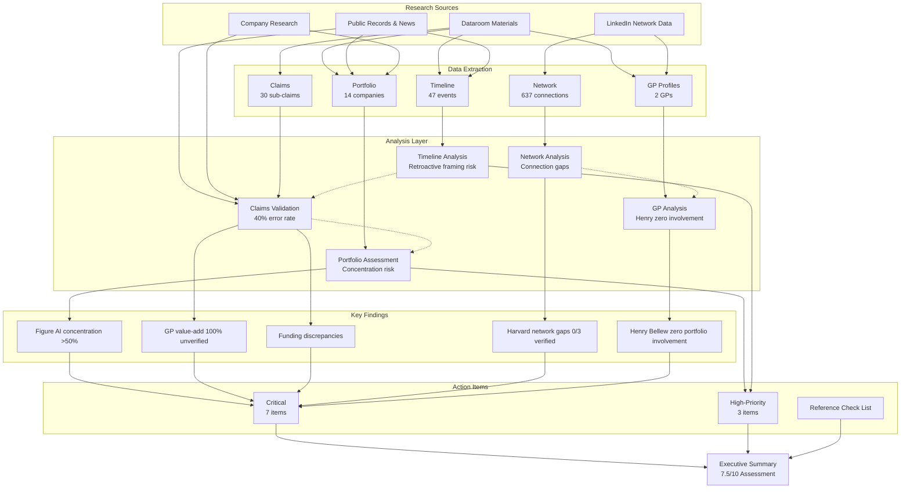

# Analysis Flow & Dependencies

**Created**: 2025-11-18
**Purpose**: Document how analyses feed into each other and the order of completion

---

## Analysis Flow

---

## Analysis Order (Chronological)

### Phase 1: Data Collection
1. **Dataroom ingestion** - Convert raw materials to markdown
2. **LinkedIn export** - Extract 637 connections
3. **Company research** - 14 companies, 3-9 sources each
4. **Public records search** - Funding announcements, news articles

### Phase 2: Data Extraction
5. **Timeline extraction** - 47 events from all sources
6. **Network mapping** - Categorize 637 connections by firm type
7. **Portfolio structuring** - 14 companies with metrics
8. **Claims inventory** - 30 sub-claims across 6 categories
9. **GP profiles** - Dillon & Henry backgrounds and involvement

### Phase 3: Analysis
10. **Timeline analysis** - Identify retroactive framing patterns
11. **Network analysis** - Map deal flow gaps and relationship depth
12. **Portfolio assessment** - Quality scoring, concentration risk
13. **Claims validation** - Cross-reference against evidence
14. **GP analysis** - Involvement patterns, Henry absence

### Phase 4: Synthesis
15. **Critical findings identification** - 5 key issues
16. **Recommendations development** - Priority-organized actions
17. **Executive summary** - 7.5/10 overall assessment

---

## Key Dependencies

| Analysis | Depends On | Feeds Into |
|----------|------------|------------|
| Timeline | Dataroom, Public Records | Claims Validation, Retroactive Framing |
| Network | LinkedIn Data | GP Analysis, Deal Flow Assessment |
| Portfolio | Company Research, Dataroom | Concentration Risk, Co-investor Validation |
| Claims | Timeline, Portfolio | Funding Discrepancies, Value-add Verification |
| GP | Network, Portfolio | Henry Role Questions, Team Assessment |

---

## Critical Cross-Validations

1. **Claims vs Timeline**: Sequencing of thought leadership vs investments
2. **Network vs GP Claims**: LinkedIn connections vs claimed relationships
3. **Portfolio vs Claims**: Funding amounts in dataroom vs public announcements
4. **Timeline vs Network**: When relationships formed vs when deals occurred

---

## Document Version
- **Version**: 1.0
- **Last Updated**: 2025-11-18
