# Hyperion Folder Reorganization Proposal

**Date**: 2025-11-17
**Purpose**: Reorganize users/tam/hyperion/ to surface CTAs, improve navigation, and add process transparency

---

## Current Structure Issues

### Problem 1: Main Outputs Buried
- Key outputs in `hyperion/outputs/` folder (3 levels deep)
- Supporting research at same level creates cognitive load
- No clear hierarchy between "what matters" vs "supporting evidence"

### Problem 2: No CTA/Action Layer
- Recommendations scattered across analysis files
- No dedicated space to surface "what should I do next?"
- Hard to connect analysis → actionable next steps

### Problem 3: Missing Process Transparency
- No documentation of inputs, prompts, workflows used
- Can't trace "how did we get this result?"
- Difficult to update/iterate on analyses

### Problem 4: Navigation Challenges
- No index/hub page to understand the full picture
- Terminology (Tier 1/2/3, claims structure) not explained upfront
- No visual relationships between claims and validations

---

## Proposed New Structure

```
users/tam/hyperion/
│
├── index.md                          # Executive Summary & Navigation Hub
│   ├── Data Room Assessment (claims, gaps, validation methods)
│   ├── Critical CTAs/Recommendations (top 5-7 action items)
│   └── Analysis Navigation (with status indicators)
│
├── ctas/                             # Call-to-Action Pages (NEW)
│   ├── index.md                      # All CTAs with priority levels
│   ├── verify-gp-relationships.md    # CTA: Independent founder interviews
│   ├── validate-figure-execution.md  # CTA: Deep dive on Figure AI risk
│   ├── investigate-henry-bellew.md   # CTA: Understand co-GP absence
│   ├── verify-customer-claims.md     # CTA: Validate Dirac/Natrion claims
│   ├── network-analysis-deeptech.md  # CTA: Quantify network depth
│   └── calibrate-portfolio-metrics.md# CTA: Benchmark against Craft/Basis Set
│
├── analyses/                         # Main Analyses (ELEVATED)
│   ├── claims-validation.md          # Tier-by-tier verification + CTAs
│   ├── portfolio-assessment.md       # vc-research-summary (renamed)
│   ├── network-analysis.md           # Consolidated network insights
│   ├── objective-timeline.md         # Timeline with overlay capability
│   └── reference-check-targets.md    # Who to talk to + why
│
├── supporting-research/              # Evidence Base (ORGANIZED)
│   ├── deals/
│   │   ├── tier-1/                   # High priority companies (5)
│   │   └── tier-2/                   # Medium priority companies (9)
│   ├── people/
│   │   ├── dillon-dunteman/          # GP research
│   │   ├── henry-bellew/             # Co-GP research
│   │   └── linkedin-network/         # Network exports & analysis
│   └── process/
│       ├── research-progress.md
│       ├── company-clusters.md
│       └── methodology.md
│
├── dataroom/                         # Source Materials (UNCHANGED)
│   └── [original dataroom files]
│
└── _data/                            # Structured Data (NEW)
    ├── claims-tree.json              # Hierarchical claims structure
    ├── cta-to-analysis-map.json      # Navigation links
    ├── portfolio-companies.csv       # Master company list
    └── terminology.json              # Definitions (Tier 1/2/3, etc.)
```

---

## Key Improvements

### 1. Process Transparency Template

Every analysis page gets standardized frontmatter showing:
- **Inputs**: What data sources were used
- **Workflow**: Which workflow/prompt template
- **Methodology**: Step-by-step process
- **Results**: What was generated
- **Linked CTAs**: What actions this analysis recommends

**Example Frontmatter** (all analyses):

```yaml
---
analysis_type: "Claims Validation"
generated_date: "2025-11-12"
last_updated: "2025-11-15"

inputs:
  - dataroom: "users/tam/hyperion/dataroom/"
  - external_research: "users/tam/hyperion/supporting-research/deals/"
  - linkedin_data: "users/tam/hyperion/supporting-research/people/linkedin-network/"

workflow: "users/tam/workflows/vc-research.md"
prompt_version: "v2.3"

methodology:
  - step: "Extract claims from dataroom materials"
  - step: "Build objective timeline from independent sources (Tier 3)"
  - step: "Cross-reference claims vs timeline"
  - step: "Generate CTAs for unverified/conflicting claims"

results:
  verified_claims: 8
  unverified_claims: 5
  ctas_generated: 6

linked_ctas:
  - ctas/verify-gp-relationships.md
  - ctas/verify-customer-claims.md
---
```

### 2. CTAs as First-Class Citizens

**Template**: `users/tam/hyperion/ctas/verify-gp-relationships.md`

```markdown
---
cta_id: "CTA-001"
priority: "CRITICAL"
status: "pending"
driving_analyses:
  - analyses/claims-validation.md (Unverifiable Value-Add)
  - analyses/portfolio-assessment.md (GP Value-Add Claims Entirely Unverified)
  - analyses/reference-check-targets.md (High Priority Contacts)
---

# CTA: Verify GP Relationships Through Independent Founder Interviews

## Why This Matters (Risk Level: HIGH)
100% of Dillon relationship evidence comes from GP-controlled dataroom sources. Zero external validation creates significant risk of unsubstantiated value-add claims.

## Driving Evidence
- **From Claims Validation**: "Unverifiable Value-Add: Most value-add claims (hiring referrals, VC introductions, advisory roles) have NO independent verification"
  → [See full analysis](../analyses/claims-validation.md#key-claim-1)

- **From Portfolio Assessment**: Natrion GM "customer" claim found to be false, Emerge Apple/Meta "acquisition" claim unverified
  → [See details](../analyses/portfolio-assessment.md#gp-value-add)

- **From Network Analysis**: Need to verify "33% of Dillon's network in deeptech" translates to actual referrals
  → [See network map](../analyses/network-analysis.md)

## Recommended Action

### 1. Tier 1 Interviews (3-5 founders from top companies)
- Brett Adcock (Figure AI) — verify sourcing story via Tamarack
- Ilyas Khan (Quantinuum) — verify early entry and ongoing relationship
- [See full list](../analyses/reference-check-targets.md#high-priority)

### 2. Questions to Ask
- "How did Dillon add value post-investment?"
- "Can you provide specific examples of introductions/hires he facilitated?"
- "Would you work with him again? Why or why not?"

### 3. Cross-Reference with Dataroom Claims
Match answers against specific claims in dataroom materials:
- Figure case study: "Dillon sourced via Tamarack relationship"
- Quantinuum: "Earliest institutional investor" (verify March 2020 date)

## Expected Timeline
2-3 weeks (coordinate via warm intros from co-investors)

## Mitigation if Not Completed
Cannot confidently assess GP value-add; recommend 20-30% valuation haircut on fund assessment

## Related CTAs
- [CTA-003: Verify Customer Claims](verify-customer-claims.md) (similar validation gap)
- [CTA-005: Network Analysis](network-analysis-deeptech.md) (quantify referral potential)
```

**All CTAs to Create**:
1. **verify-gp-relationships.md** — Independent founder interviews (CRITICAL)
2. **validate-figure-execution.md** — BMW deployment, revenue diligence (CRITICAL)
3. **verify-customer-claims.md** — Dirac/Natrion customer validation (HIGH)
4. **investigate-henry-bellew.md** — Understand co-GP absence (HIGH)
5. **network-analysis-deeptech.md** — Quantify Cursor/Mercor/Devin connections (MEDIUM)
6. **calibrate-portfolio-metrics.md** — Benchmark vs Craft/Basis Set (MEDIUM)
7. **integrate-timeline-network.md** — Overlay "when connected" on timeline (LOW)

### 3. Enhanced Claims Validation with Visual Hierarchy

**Addition to `analyses/claims-validation.md`**:

```markdown
## Claims Structure Visualization

```mermaid
graph TD
    C1[Claim 1: Sourcing Differentiation] --> C1.1[50+ referrals/year]
    C1 --> C1.2[300+ potential with Hyperion]
    C1 --> C1.3[Deeptech network depth]

    C1.1 --> V1.1{❓ Unverified}
    C1.2 --> V1.2{❓ Unverified}
    C1.3 --> V1.3{⚠️ Partial}

    V1.1 --> CTA5[CTA-005: Network Analysis]
    V1.3 --> CTA5

    C2[Claim 2: Value-Add] --> C2.1[Hiring referrals]
    C2 --> C2.2[VC introductions]
    C2 --> C2.3[Advisory roles]

    C2.1 --> V2.1{❓ Unverified}
    C2.2 --> V2.2{❓ Unverified}
    C2.3 --> V2.3{❓ Unverified}

    V2.1 --> CTA1[CTA-001: Verify GP Relationships]
    V2.2 --> CTA1
    V2.3 --> CTA1
```



## Verification Tiers Explained
- **Tier 1 (Dataroom)**: GP-controlled sources (pitch deck, case studies). Highest bias risk.
- **Tier 2 (Influenced)**: Company PR, founder interviews, pitch materials. Moderate bias.
- **Tier 3 (Independent)**: TechCrunch, SEC filings, LinkedIn, public records. Most objective.

---

### Claim 1.1: Network Depth in Deeptech
**Status**: ⚠️ Partially Verified

**Evidence**:
- ✅ Tier 3 (LinkedIn): 33% of Dillon's 1000+ connections work in deeptech sectors
  → [See full network analysis](network-analysis.md#deeptech-concentration)
- ✅ Tier 3 (Harvard Alumni): Strong Harvard CS/Engineering network
  → [See Harvard analysis](../supporting-research/people/linkedin-network/connections_harvard.csv)

**Gap**: While network EXISTS, no evidence it translates to actual deal referrals

**Generated CTA**: → [CTA-005: Verify referral conversion via targeted network analysis](../ctas/network-analysis-deeptech.md)

**Specific Test**: Can we find connections to Cursor, Mercor, Devin/Cognition founders/employees? These would validate the "deeptech referral" claim concretely.
```

### 4. Index/Hub Page Structure

**users/tam/hyperion/index.md:**

```markdown
# Hyperion Ventures Fund I: Due Diligence Assessment

**Last Updated**: 2025-11-17
**Research Status**: 14 of 24 companies researched | 6 CTAs pending

---

## Data Room Quick Assessment

**Overall Fund Quality**: 7.5/10 (Above Average/Strong)

**Key Narrative**:
- Proprietary deeptech deal flow via Harvard/Vista network + thought leadership
- Early-stage pre-seed/seed investor with tier-1 co-investor validation
- GP adds value through introductions, hiring referrals, advisory support

**Conspicuous Gaps**:
- ❌ No independent validation of GP value-add claims
- ❌ Missing 18 of 24 portfolio company investment details
- ❌ 3 unnamed underperforming investments (opacity on failures)
- ❌ Henry Bellew (co-GP) has zero documented portfolio involvement

**Validation Methods Applied**:
- ✅ Network analysis (quantified deeptech connections: 33% of 1000+)
- ✅ Timeline construction (independent sources only, Tier 3)
- ✅ Portfolio research (company-by-company deep dives, 14 done)
- 🔄 Reference checks (targets identified, in progress)

---

## Critical CTAs (Action Required)

### 🔴 CRITICAL Priority

1. **[Verify GP Relationships](ctas/verify-gp-relationships.md)**
   - **Why**: 100% of value-add claims unverified; Natrion/Emerge false claims found
   - **Action**: Independent founder interviews (Brett Adcock, Ilyas Khan, 3-5 more)
   - **Timeline**: 2-3 weeks
   - **Mitigation**: 20-30% valuation haircut if not completed

2. **[Validate Figure AI Execution Risk](ctas/validate-figure-execution.md)**
   - **Why**: Single company = 50%+ of portfolio value at $39.5B on minimal revenue
   - **Action**: BMW deployment verification, revenue diligence, competitive analysis
   - **Timeline**: 1-2 weeks
   - **Mitigation**: Portfolio returns highly binary without this validation

### 🟡 HIGH Priority

3. **[Investigate Customer Claims](ctas/verify-customer-claims.md)**
   - **Why**: Dirac "pilots with Anduril/Lockheed" found no public evidence
   - **Action**: Direct company verification or co-investor confirmation (Founders Fund)
   - **Timeline**: 1 week

4. **[Investigate Henry Bellew Absence](ctas/investigate-henry-bellew.md)**
   - **Why**: Co-GP shows zero documented involvement across 14 companies
   - **Action**: Reference checks with founders/LPs on team utilization
   - **Timeline**: 1-2 weeks (coordinate with CTA-001)

### 🟢 MEDIUM Priority

5. **[Network Analysis: Deeptech Referral Validation](ctas/network-analysis-deeptech.md)**
   - **Why**: Claimed "300+ referrals/year potential" needs concrete evidence
   - **Action**: Trace connections to Cursor, Mercor, Devin/Cognition networks
   - **Timeline**: 3-5 days

6. **[Calibrate Portfolio Metrics](ctas/calibrate-portfolio-metrics.md)**
   - **Why**: Rating system needs benchmarking (how does 7.5/10 compare to Craft/Basis Set?)
   - **Action**: Run workflow on 2-3 known funds to establish baseline
   - **Timeline**: 1 week

7. **[Integrate Timeline + Network Data](ctas/integrate-timeline-network.md)**
   - **Why**: "When did Dillon connect to X person?" would validate sourcing claims
   - **Action**: LinkedIn connection date extraction + timeline overlay
   - **Timeline**: 1-2 weeks (lower priority, data may not exist)

[See all CTAs with full details →](ctas/index.md)

---

## Main Analyses

### [Claims Validation](analyses/claims-validation.md)
Cross-reference marketing claims vs objective timeline

- **Status**: ✅ Complete | Last Updated: 2025-11-12
- **Key Finding**: 8 verified, 5 unverified, 1 contradicted claim out of 24 sub-claims
- **Critical Issues**: Unverifiable value-add, customer claims contradicted, funding discrepancies
- **Generated CTAs**: 4 (CTA-001, CTA-003, CTA-005, CTA-007)
- **Process**: [Inputs: Dataroom + Objective Timeline | Workflow: vc-research.md | Methodology: Tier-based validation]

### [Portfolio Assessment](analyses/portfolio-assessment.md)
Company-by-company research & health scoring

- **Status**: 🔄 In Progress (14 of 24 companies) | Last Updated: 2025-11-15
- **Key Finding**: Portfolio driven by single 94x outlier (Figure AI at $39.5B)
- **Rating**: 7.5/10 (Above Average/Strong) with concentration risk caveat
- **Generated CTAs**: 3 (CTA-001, CTA-002, CTA-004)
- **Process**: [Inputs: Public sources + Dataroom | Workflow: vc-research.md | Methodology: 3-tier validation]

### [Network Analysis](analyses/network-analysis.md)
Quantify deeptech network depth and referral potential

- **Status**: ✅ Complete | Last Updated: 2025-11-14
- **Key Finding**: 33% of Dillon's 1000+ connections in deeptech; Harvard network strong
- **Gap**: Network exists but no proof of referral conversion
- **Generated CTAs**: 2 (CTA-005, CTA-007)
- **Process**: [Inputs: LinkedIn exports | Workflow: linkedin-network-checker.md | Methodology: Industry tagging + relationship mapping]

### [Objective Timeline](analyses/objective-timeline.md)
Investment timeline from independent sources only

- **Status**: ✅ Complete | Last Updated: 2025-11-12
- **Key Finding**: Only 6 of 24 investments have verified dates; thought leadership post-dated first win
- **Gap**: Missing "when connected" data reduces utility
- **Generated CTAs**: 1 (CTA-007)
- **Process**: [Inputs: TechCrunch, SEC, company announcements | Workflow: Custom timeline script | Methodology: Tier 3 only]

### [Reference Check Targets](analyses/reference-check-targets.md)
Who to talk to + warm intro paths

- **Status**: ✅ Complete | Last Updated: 2025-11-13
- **Key Finding**: 8 high-priority contacts identified with mutual connections
- **Top Targets**: Jamie Lee (Tamarack), Brett Adcock (Figure), 11 Vista contacts
- **Generated CTAs**: 1 (CTA-001)
- **Process**: [Inputs: LinkedIn + Dataroom claims | Workflow: Custom mapping | Methodology: Claim → Contact → Mutual path]

[See all analyses →](analyses/)

---

## Supporting Research

### Portfolio Companies
- **[Tier 1 Companies](supporting-research/deals/tier-1/)** (5 companies)
  - Figure AI, Quantinuum, Normal Computing, Dirac, Scout AI
  - Research status: ✅ Complete

- **[Tier 2 Companies](supporting-research/deals/tier-2/)** (9 companies)
  - Biofire, Haiqu, Natrion, Innerworks, Emerge, Marathon Fusion, Mesh Optical, Scout, Hephaestus
  - Research status: ✅ Complete

### GP Research
- **[Dillon Dunteman](supporting-research/people/dillon-dunteman/)** — Background, Firmament, Harvard, Substack
- **[Henry Bellew](supporting-research/people/henry-bellew/)** — Background research
- **[LinkedIn Network](supporting-research/people/linkedin-network/)** — Connection exports, analysis CSVs

### Process Documentation
- **[Research Progress](supporting-research/process/research-progress.md)** — What's done, what's pending
- **[Company Clusters](supporting-research/process/company-clusters.md)** — Tier groupings
- **[Methodology](supporting-research/process/methodology.md)** — How research was conducted

[See all supporting research →](supporting-research/)

---

## Dataroom Source Materials

[Original dataroom files →](dataroom/)

Files include:
- GP Bio, Fund I Overview, Sourcing Differentiation
- Case Studies (Outperforming, Recent, Underperforming)
- Founder References, Service Providers, Diligence Process
- Deeptech Perspectives

---

## Terminology Guide

**Verification Tiers**:
- **Tier 1 (Dataroom)**: GP-controlled sources. Highest bias risk.
- **Tier 2 (Influenced)**: Company PR, founder materials. Moderate bias.
- **Tier 3 (Independent)**: Public records, news, LinkedIn. Most objective.

**Company Tiers**:
- **Tier 1**: High-priority research targets (strategic importance or red flags)
- **Tier 2**: Medium-priority research targets
- **Tier 3**: Low-priority (too early, confirmed dead, or low materiality)

**Status Indicators**:
- ✅ Complete
- 🔄 In Progress
- ❌ Blocked/Failed
- 🔴 Critical Priority
- 🟡 High Priority
- 🟢 Medium Priority
```

### 5. Enhanced Portfolio Assessment

**Additions to `analyses/portfolio-assessment.md`**:

```markdown
---
analysis_type: "Portfolio Assessment"
generated_date: "2025-01-12"
last_updated: "2025-01-15"

inputs:
  - dataroom: "users/tam/hyperion/dataroom/"
  - external_research: "users/tam/hyperion/supporting-research/deals/"
  - benchmarks: "None (TODO: add Craft/Basis Set)"

workflow: "users/tam/workflows/vc-research.md"
prompt_version: "v2.3"

methodology:
  - step: "Research each company via public sources (Tier 3)"
  - step: "Cross-reference with dataroom claims (Tier 1)"
  - step: "Score companies on traction, validation, GP relationship quality"
  - step: "Calculate portfolio-level metrics and risk assessment"

results:
  companies_researched: 14
  strong_performers: 4
  red_flags: 2
  overall_rating: "7.5/10"

linked_ctas:
  - ctas/verify-gp-relationships.md
  - ctas/validate-figure-execution.md
  - ctas/investigate-henry-bellew.md
  - ctas/calibrate-portfolio-metrics.md
---

# VC Portfolio Research: Executive Summary

[Existing content...]

## Rating System Explanation

**Overall Score: 7.5/10 (Above Average/Strong)**

### How the Rating Was Calculated
- **Portfolio Quality** (3/4): Strong performers + tier-1 co-investors
- **GP Value-Add** (1/4): Entirely unverified = lowest score
- **Diversification** (2/4): 50%+ concentration in Figure AI = risk
- **Downside Protection** (1.5/4): 3 unnamed failures + opacity = concern

**Generated CTA**: [Calibrate this rating system against known benchmarks](../ctas/calibrate-portfolio-metrics.md) to validate scoring methodology.

### Benchmark Needed
To properly assess whether 7.5/10 is accurate:
- Run this workflow on Craft Ventures (known strong fund)
- Run on Basis Set (known performance data)
- Compare scoring to establish if 7.5 = "strong" or "average"

---

## Company-Level Insights with Source Links

### 🌟 Natrion (Red Flag Example)

**Claimed (Tier 1 - Dataroom)**: "Natrion has pilots with GM"

**Found (Tier 3 - Public Research)**:
- ❌ NO evidence of GM pilots in company website, press releases, or GM announcements
- ❌ Searched: "Natrion GM", "Natrion General Motors", company announcements 2023-2025
- ✅ DID find: Mark Cuban seed funding, battery tech focus
- **Source**: [Natrion research summary](../supporting-research/deals/tier-2/natrion/research-summary.md)

**Analysis**: This is a **material false claim** in the dataroom. Either:
1. Pilots exist but are confidential (unlikely for marketing material)
2. GP misunderstood relationship (sloppy diligence)
3. GP fabricated claim (credibility risk)

**Generated CTA**: [Verify customer claims directly](../ctas/verify-customer-claims.md) — Natrion + Dirac validation required

---

[Rest of existing content with similar "show your work" links throughout...]
```

---

## Migration Plan

### Phase 1: Create New Structure (No Moves Yet)
1. Create new directories: `ctas/`, `analyses/`, `supporting-research/`, `_data/`
2. Keep existing `outputs/` and `research/` folders untouched during testing

### Phase 2: Add Process Frontmatter
1. Add YAML frontmatter to existing files in `outputs/`:
   - claims-validation.md
   - vc-research-summary.md (will rename to portfolio-assessment.md)
   - network-analysis.md
   - objective-timeline.md
   - reference-check-targets.md

### Phase 3: Generate CTA Pages
1. Create 7 CTA pages in `ctas/` folder
2. Extract recommendations from existing analyses
3. Link back to "driving evidence" in analyses

### Phase 4: Create Index/Hub
1. Create `index.md` with navigation and summary
2. Create `ctas/index.md` with CTA overview

### Phase 5: Move Files to New Locations
1. Move `outputs/*.md` → `analyses/`
2. Move `research/deals/` → `supporting-research/deals/`
3. Move `research/people/` → `supporting-research/people/`
4. Move `research/process/` → `supporting-research/process/`
5. Delete old empty folders

### Phase 6: Update Eleventy Config
1. Update navigation templates to show new structure
2. Add terminology tooltip support
3. Add popup/modal support for inline links
4. Add visual timeline rendering

### Phase 7: Add Interactive Features
1. Generate `_data/claims-tree.json` for Mermaid diagrams
2. Generate `_data/terminology.json` for tooltips
3. Generate `_data/cta-to-analysis-map.json` for bidirectional linking
4. Update templates to render interactive elements

---

## Benefits Summary

### For User Experience (Tam's View)

**Before**:
- Navigate to `users/tam/hyperion/outputs/claims-validation.md`
- Read through entire document
- Try to remember which issues need follow-up
- Switch to `vc-research-summary.md` to cross-reference
- Manually connect dots between analyses

**After**:
- Land on `users/tam/hyperion/index.md`
- See top 3 CTAs immediately with priority levels
- Click CTA to see why it matters + all supporting evidence
- Each evidence link has inline popups (no tab switching)
- Terminology tooltips explain "Tier 3" on hover
- Process frontmatter shows "how was this made?" for auditability

### For Iteration/Updates

**Before**:
- User provides new data (e.g., Tegus/AlphaSense interviews)
- Unclear which analysis to update
- No documentation of what inputs were used originally
- Manual search for related files

**After**:
- Process frontmatter shows exact inputs/workflow used
- Update inputs (add Tegus data to `supporting-research/people/`)
- Re-run workflow with version tracking
- CTA status updates automatically link to revised analysis
- Change log in index.md shows what's new

### For Stakeholder Communication

**Before**:
- Send 5 separate markdown files
- Stakeholder reads linearly, misses CTAs
- Follow-up questions: "What should I do with this?"

**After**:
- Send single link: `users/tam/hyperion/index.md`
- Executive summary → CTAs → Deep dives (drill-down navigation)
- Clear "if you read nothing else, do these 3 things" section
- Each CTA has "why this matters" + "what happens if we skip this"

---

## Open Questions for User

1. **Benchmarking**: Do you have access to Craft Ventures or Basis Set data rooms to calibrate the rating system?

2. **Tegus/AlphaSense**: You mentioned these datasets would be "huge" — do you want to add a CTA for "obtain Tegus interviews on portfolio companies"?

3. **Google Calendar/Affinity**: You wished for calendar API data to see "when did connections form" — should we add this as a data gap CTA?

4. **Visual Timeline**: Do you want an actual visual timeline (e.g., interactive D3.js chart) vs the current markdown table format?

5. **Reference Check Workflow**: Once you complete founder interviews, do you want a workflow to integrate those results back into the analysis? (e.g., "update claims-validation.md based on Brett Adcock interview")

6. **Word Cloud**: You mentioned wanting a "word cloud of Dylan's network" — add this as a visualization CTA?

---

## Next Steps

**Recommended Immediate Actions**:

1. **Review this proposal** — Does the structure make sense? Any changes needed?

2. **Approve migration** — Should we proceed with implementing this reorganization?

3. **Prioritize CTAs** — Which of the 7 CTAs should be worked on first?
   - Recommended: CTA-001 (verify GP relationships) + CTA-002 (Figure AI validation)

4. **Identify benchmark data** — Can you provide access to a known fund's data room to calibrate the rating system?

**Implementation Timeline** (if approved):
- Phase 1-2: 1-2 hours (structure + frontmatter)
- Phase 3-4: 2-3 hours (CTAs + index)
- Phase 5-6: 1-2 hours (migration + Eleventy updates)
- Phase 7: 3-4 hours (interactive features)

**Total**: ~8-12 hours of work

---

**Ready to proceed?** Let me know if you want to:
- A) Implement the full reorganization
- B) Start with just the CTAs layer (quickest value)
- C) Modify the structure first (feedback needed)
- D) See a working example on one analysis first (proof of concept)
