# Hyperion Folder Reorganization Proposal

**Date**: 2025-11-16
**Version**: 2.0 (Phase-Based Workflow)
**Purpose**: Reorganize users/tam/hyperion/ around 4-phase analytical workflow with full traceability from CTAs back to source evidence

---

## Table of Contents

1. [Current Structure Issues](#current-structure-issues)
2. [Phase-Based Analytical Workflow](#phase-based-analytical-workflow)
3. [Proposed New Structure](#proposed-new-structure)
4. [Evidence Tier Framework](#evidence-tier-framework)
5. [Claims Validation Mapping](#claims-validation-mapping)
6. [Process Transparency Templates](#process-transparency-templates)
7. [CTA Design Patterns](#cta-design-patterns)
8. [Index/Hub Page Structure](#index-hub-page-structure)
9. [Structured Data Schemas](#structured-data-schemas)
10. [Visual Hierarchy & Diagrams](#visual-hierarchy-diagrams)
11. [Migration Plan](#migration-plan)
12. [Benefits Summary](#benefits-summary)
13. [Implementation Guide](#implementation-guide)
14. [Open Questions](#open-questions)
15. [Next Steps](#next-steps)

---

## Current Structure Issues

### Problem 1: Main Outputs Buried
- Key outputs in `hyperion/outputs/` folder (3 levels deep)
- Supporting research at same level creates cognitive load
- No clear hierarchy between "what matters" vs "supporting evidence"

### Problem 2: No CTA/Action Layer
- Recommendations scattered across analysis files
- No dedicated space to surface "what should I do next?"
- Hard to connect analysis → actionable next steps

### Problem 3: Missing Process Transparency
- No documentation of inputs, prompts, workflows used
- Can't trace "how did we get this result?"
- Difficult to update/iterate on analyses

### Problem 4: Navigation Challenges
- No index/hub page to understand the full picture
- Terminology (Tier 1/2/3, claims structure) not explained upfront
- No visual relationships between claims and validations

### Problem 5: No Phase-Based Workflow Tracking
- Unclear which analyses depend on which others
- No visibility into analytical progression (dataroom → portfolio → network → synthesis)
- Can't see which phase validated which claims

### Problem 6: Evidence Tier Validation Not Systematically Tracked
- Claims validation scattered across multiple files
- No structured mapping of claim → evidence → tier → status
- Hard to answer: "Which Phase 1 claims did Phase 2 validate?"

---

## Phase-Based Analytical Workflow

### Design Principles

**1. Sequential Phase-Gating**

Each phase builds on validated outputs from the previous phase:
- **Phase 1** extracts claims from dataroom → **Phase 2** validates via portfolio research → **Phase 3** validates via network analysis → **Phase 4** synthesizes into recommendations

**2. Full Traceability**

Every CTA traces backwards through analytical layers:
```
CTA → Phase 4 Analysis → Phase 2/3 Evidence → Phase 1 Claim → Dataroom Source
```

**3. Evidence Tier Progression**

- **Phase 1**: Tier 1 (GP sources) - claims extraction only
- **Phase 2**: Tier 2 + Tier 3 (external sources) - portfolio validation
- **Phase 3**: Tier 3 (independent sources) - network validation
- **Phase 4**: All tiers - synthesis and translation

**4. JSON-First for Structured Data**

Critical data stored as JSON for programmatic cross-referencing:
- `claims-inventory.json` - Hierarchical claims structure
- `validation-map.json` - Claims → Evidence → Status mapping
- `network-stats.json` - Quantitative network metrics
- `phase-status.json` - Phase completion tracking

### Phase Descriptions

#### Phase 0: Context & Orientation

**Purpose**: Provide methodology and navigation

**Outputs**:
- README (start here guide)
- Methodology docs (evidence tiers, phase workflow)
- Terminology glossary

**Evidence Tier**: N/A (meta-level)

---

#### Phase 1: Dataroom Analysis

**Purpose**: Extract GP claims and assess evidence quality

**Analytical Question**: "What is the GP claiming, and what evidence did they provide?"

**Outputs**:
- Claims inventory (hierarchical structure with claim IDs)
- Evidence tier classification per claim
- Gaps identified (what's missing from dataroom)
- Validation plan (how to externally verify each claim)

**Evidence Tier**: Tier 1 (GP-controlled sources)

**Success Criteria**: 100% of claims catalogued with tier classifications

---

#### Phase 2: Portfolio Validation

**Purpose**: Validate claims via external research on portfolio companies

**Analytical Question**: "Do the portfolio companies validate the GP's claims?"

**Outputs**:
- Per-company research (14 companies across tier 1 and tier 2)
- Funding validation (claimed vs actual rounds)
- Portfolio assessment (overall quality scoring)
- Claims validated report (which Phase 1 claims were verified/contradicted)

**Evidence Tier**: Tier 2 + Tier 3 (external sources)

**Success Criteria**: 80%+ of material claims verified or contradicted

---

#### Phase 3: Network Analysis

**Purpose**: Validate relationship and referral claims through network data

**Analytical Question**: "Does Dillon's network validate his claimed relationships and sourcing capabilities?"

**Rationale for Including People in Phase 3**:
- Phase 3 **IS** the analysis of Dillon's network (not a separate concern)
- Harvard/deeptech/VC-PE are **dimensions** of Dillon's network, not standalone entities
- All LinkedIn CSVs are **Dillon's connections** → belong under `dillon-dunteman/`
- Henry Bellew analyzed as **comparison point** (co-GP with no network visibility = red flag)

**Outputs**:
- Network depth quantification across dimensions (Harvard, deeptech, VC/PE)
- Claimed relationship verification (6 founders claimed, X verified)
- Referral conversion proof (network exists → actual referrals?)
- Henry Bellew absence analysis (why no network data?)

**Evidence Tier**: Tier 3 (independent sources like LinkedIn)

**Success Criteria**: Network claims validated with concrete examples

---

#### Phase 4: Synthesis & Recommendations

**Purpose**: Translate marketing claims to reality and generate actionable CTAs

**Analytical Question**: "What should we do next based on all validation efforts?"

**Outputs**:
- Marketing-to-reality translation (GP spin → objective facts)
- Investment recommendation (overall verdict)
- Objective timeline (chronological narrative with tier tags)
- Reference check targets (who to talk to, warm intro paths)
- CTAs (prioritized action items with full traceability)

**Evidence Tier**: All tiers (synthesized)

**Success Criteria**: Clear investment recommendation with risk-adjusted mitigations

---

### Phase Dependencies


**Phase Gating**: Phase 4 final recommendation should be blocked until Phase 2 reaches 80%+ completion (prevents premature conclusions on incomplete evidence).

---

## Proposed New Structure

```
users/tam/hyperion/
│
├── 0-context/                          # Orientation & Methodology
│   ├── README.md                       # Start here: fund overview, navigation guide
│   ├── methodology.md                  # Evidence tiers, phase workflow explained
│   ├── evidence-tiers.md               # Tier 1/2/3 definitions and usage
│   ├── terminology.json                # Glossary (structured data)
│   └── traceability-guide.md           # How to trace CTA → analysis → source
│
├── 1-dataroom/                         # Phase 1: GP Claims Extraction
│   ├── phase1-index.md                 # Phase 1 outputs summary
│   ├── claims-inventory.json           # Machine-readable claims tree
│   ├── claims-inventory.md             # Human-readable with dataroom citations
│   ├── evidence-assessment.md          # What evidence GP provided per claim
│   ├── validation-plan.md              # Proposed external validation methods
│   └── source-materials/               # Raw dataroom files (moved from dataroom/)
│       ├── GP Bio.md
│       ├── Fund I.md
│       ├── Sourcing Differentiation.md
│       └── [all other dataroom files...]
│
├── 2-portfolio/                        # Phase 2: External Portfolio Validation
│   ├── phase2-index.md                 # Phase 2 outputs summary
│   ├── portfolio-assessment.md         # Main synthesis (from vc-research-summary)
│   ├── portfolio-companies.json        # Structured company data
│   ├── portfolio-claims-validated.md   # Which Phase 1 claims did we validate?
│   │
│   ├── companies/                      # Per-company research (moved from research/deals/)
│   │   ├── tier1-winners/              # 5 high-priority companies
│   │   │   ├── figure/
│   │   │   │   ├── company-summary.md
│   │   │   │   ├── valuation-validation.md     # GP marks vs reality
│   │   │   │   ├── gp-claims-check.md          # What GP said vs what we found
│   │   │   │   └── sources/                    # Evidence (tier-tagged)
│   │   │   │       ├── [TIER-3] series-b-funding-feb-2024.md
│   │   │   │       ├── [TIER-3] bmw-partnership-deployment.md
│   │   │   │       └── [TIER-2] company-website.md
│   │   │   ├── quantinuum/
│   │   │   ├── normal-computing/
│   │   │   ├── dirac/
│   │   │   └── scout-ai/
│   │   │
│   │   └── tier2-emerging/             # 9 medium-priority companies
│   │       ├── natrion/
│   │       ├── emerge/
│   │       ├── hephaestus/
│   │       └── [6 more companies...]
│   │
│   └── data/                           # Structured portfolio data
│       ├── funding-rounds.json         # All rounds with dates, amounts, sources
│       ├── valuation-history.json      # GP claims vs public data
│       ├── co-investors.json           # Who invested alongside Dillon
│       └── claim-validation-map.json   # Phase 1 claim ID → Phase 2 evidence
│
├── 3-network/                          # Phase 3: Network & Relationship Validation
│   ├── phase3-index.md                 # Phase 3 outputs summary
│   ├── network-synthesis.md            # Overall network characterization
│   ├── network-claims-validated.md     # Which Phase 1 network claims validated?
│   │
│   ├── dillon-dunteman/                # Primary GP network analysis
│   │   ├── profile-summary.md          # Background, Harvard, Vista, Firmament
│   │   ├── substack-analysis.md        # Thought leadership timeline
│   │   ├── linkedin-profile.md         # LinkedIn data overview
│   │   │
│   │   ├── harvard-network/            # School dimension of network
│   │   │   ├── analysis.md             # From network-analysis-harvard.md
│   │   │   ├── network-stats.json      # 603 connections, graduation years
│   │   │   ├── claimed-relationships.md # 6 founders claimed vs verified
│   │   │   └── raw-data/
│   │   │       └── connections_harvard.csv
│   │   │
│   │   ├── deeptech-network/           # Industry dimension of network
│   │   │   ├── analysis.md             # From network-analysis-deeptech.md
│   │   │   ├── network-stats.json      # 33% deeptech, industry breakdown
│   │   │   ├── claimed-expertise.md    # "Deeptech specialist" claim validation
│   │   │   └── raw-data/
│   │   │       └── connections_deeptech.csv
│   │   │
│   │   └── vcpe-network/               # Investor relationships dimension
│   │       ├── analysis.md             # From linkedin-industry-analysis.md
│   │       ├── network-stats.json      # 80+ VC/PE investors
│   │       ├── investor-relationships.md # Vista, Tamarack, Coatue ties
│   │       └── raw-data/
│   │           └── connections_vcpe.csv
│   │
│   ├── henry-bellew/                   # Co-GP analysis (absence pattern)
│   │   ├── profile-summary.md          # Background research
│   │   ├── network-absence.md          # Why no LinkedIn data? Red flag
│   │   └── portfolio-involvement.md    # Zero documented involvement across 14 companies
│   │
│   └── data/
│       ├── network-dimension-summary.json  # Aggregated stats across dimensions
│       └── claim-validation-map.json       # Phase 1 network claims → Phase 3 evidence
│
├── 4-synthesis/                        # Phase 4: CTAs & Recommendations
│   ├── phase4-index.md                 # Phase 4 outputs summary
│   ├── executive-summary.md            # Top-level investment recommendation (NEW)
│   ├── marketing-to-reality.md         # Translation guide: GP spin → facts (NEW)
│   ├── objective-timeline.md           # Moved from outputs/
│   ├── reference-check-targets.md      # Moved from outputs/
│   │
│   ├── ctas/                           # Call-to-actions with full traceability
│   │   ├── index.md                    # All CTAs sorted by priority
│   │   ├── CRITICAL-verify-gp-relationships.md
│   │   ├── CRITICAL-validate-figure-execution.md
│   │   ├── HIGH-investigate-henry-bellew.md
│   │   ├── HIGH-verify-customer-claims.md
│   │   ├── MEDIUM-validate-network-depth.md
│   │   └── MEDIUM-benchmark-portfolio-metrics.md
│   │
│   └── cross-phase-analysis/           # Synthesized analyses
│       ├── claims-validation-full.md   # From outputs/claims-validation.md
│       ├── discrepancy-tracker.md      # Funding gaps, timing issues (NEW)
│       └── unresolved-questions.md     # What we still can't validate (NEW)
│
└── _meta/                              # Process Tracking & Iteration Support
    ├── research-log.md                 # Chronological work log
    ├── data-update-history.md          # Track Crunchbase/PitchBook additions
    ├── workflow-versions.md            # Which workflow version generated what
    └── claims-validation-tracker.csv   # Master tracking spreadsheet
```

---

## Evidence Tier Framework

### Tier Definitions

**Tier 1 (GP-Controlled Sources)** - Highest Bias Risk
- **Examples**: Pitch deck, case studies, GP interviews, dataroom materials
- **Use**: Initial claims extraction only (Phase 1)
- **Validation Requirement**: MUST be verified by Tier 2 or Tier 3 sources
- **Bias Risk**: GP selects what to share, how to frame it

**Tier 2 (Influenced Sources)** - Moderate Bias
- **Examples**: Company PR, founder interviews, pitch materials, company websites
- **Use**: Corroborating evidence for Tier 1 claims
- **Validation Requirement**: Best when paired with Tier 3 sources
- **Bias Risk**: Companies/founders incentivized to present positive picture

**Tier 3 (Independent Sources)** - Most Objective
- **Examples**: TechCrunch, SEC filings, LinkedIn, Crunchbase, public records, court filings
- **Use**: Gold standard for claims validation
- **Validation Requirement**: Sufficient on its own for verification
- **Bias Risk**: Minimal (third-party reporting, regulatory disclosure)

### Usage Guidelines Per Phase

**Phase 1 (Dataroom)**:
- Accept all Tier 1 sources at face value
- Extract claims without judgment
- Tag each claim with evidence tier

**Phase 2 (Portfolio)**:
- Seek Tier 3 sources first
- Use Tier 2 sources as secondary validation
- Flag claims that remain Tier 1-only

**Phase 3 (Network)**:
- LinkedIn data is Tier 3 (publicly visible connections)
- Network analysis outputs are Tier 3
- Claimed relationships need founder verification (Tier 2/3)

**Phase 4 (Synthesis)**:
- Tier 1-only claims → HIGH priority CTAs
- Tier 2-only claims → MEDIUM priority CTAs
- Tier 3 validated → No CTA needed (confidence high)

---

## Claims Validation Mapping

### How Claims Flow Through Phases

Every claim follows this analytical workflow:

#### Step 1: Phase 1 Extraction
- Claim identified in dataroom → Assigned claim ID (e.g., `claim-1.1`)
- Evidence tier classified (Tier 1/2/3)
- Source documented (specific dataroom file + page)
- Added to `claims-inventory.json`

#### Step 2: Phase 2 Validation Attempt
- External research seeks Tier 2/3 evidence
- Outcome: **Verified ✅** | **Unverified ❓** | **Contradicted ❌**
- Results added to `validation-map.json`

#### Step 3: Phase 3 Network Validation (if applicable)
- Relationship claims checked against network data
- Conversion proof sought (network exists → actual referrals?)
- Results update `validation-map.json`

#### Step 4: Phase 4 Synthesis
- Unverified/contradicted claims → CTAs generated
- CTAs link back to claim IDs for full traceability
- Final recommendation incorporates validation status

### Example: Claim 1.1 Validation Flow

```json
{
  "claim_id": "claim-1.1",
  "claim_text": "Dillon generates 50+ referrals per year from his deeptech network",
  "phase_extracted": "1-dataroom",
  "source_file": "1-dataroom/source-materials/Sourcing Differentiation.md",
  "source_page": 3,
  "evidence_tier_claimed": "tier-1",

  "validation_attempts": [
    {
      "phase": "2-portfolio",
      "result": "unverified",
      "notes": "No portfolio company founders mentioned referrals in public sources",
      "evidence_tier": "tier-3",
      "source_file": "2-portfolio/portfolio-assessment.md"
    },
    {
      "phase": "3-network",
      "result": "partial",
      "notes": "Network exists (33% deeptech) but no proof of referral conversion",
      "evidence_tier": "tier-3",
      "source_file": "3-network/network-synthesis.md"
    }
  ],

  "final_status": "unverified",
  "ctas_generated": ["CTA-005"],
  "recommendation": "Require founder interviews to validate referral claim"
}
```

### Validation Tracker CSV

Track all claims in `_meta/claims-validation-tracker.csv`:

| claim_id | claim_text | phase_extracted | phase_validated | evidence_tier | status | cta_generated | source_file |
|----------|------------|-----------------|-----------------|---------------|--------|---------------|-------------|
| claim-1.1 | 50+ referrals/year | 1-dataroom | 3-network | tier-3 | partial | CTA-005 | 1-dataroom/source-materials/Sourcing Differentiation.md |
| claim-2.1 | Hiring referrals value-add | 1-dataroom | 2-portfolio | tier-3 | unverified | CTA-001 | 1-dataroom/source-materials/GP Bio.md |
| claim-3.1 | Figure sourced via Tamarack | 1-dataroom | 2-portfolio | tier-2 | verified | - | 2-portfolio/companies/tier1-winners/figure/ |

---

## Process Transparency Templates

### Analysis Frontmatter (Enhanced with Phase Fields)

Every analysis file should have standardized YAML frontmatter:

```yaml
---
analysis_type: "Portfolio Assessment"
phase: "2-portfolio"                    # Which phase does this belong to?
generated_date: "2025-11-12"
last_updated: "2025-11-15"

inputs:
  - dataroom: "users/tam/hyperion/1-dataroom/source-materials/"
  - external_research: "users/tam/hyperion/2-portfolio/companies/"
  - phase1_claims: "users/tam/hyperion/1-dataroom/claims-inventory.json"

workflow: "users/tam/workflows/vc-research.md"
prompt_version: "v2.3"

methodology:
  - step: "Research each company via public sources (Tier 3)"
  - step: "Cross-reference with dataroom claims (Tier 1)"
  - step: "Score companies on traction, validation, GP relationship quality"
  - step: "Calculate portfolio-level metrics and risk assessment"

results:
  companies_researched: 14
  strong_performers: 4
  red_flags: 2
  overall_rating: "7.5/10"

claims_validated: ["claim-3.1", "claim-3.2", "claim-3.5"]  # Which Phase 1 claims validated
claims_contradicted: ["claim-2.4"]                         # Which Phase 1 claims contradicted
evidence_tier: "tier-3"                                    # Primary evidence tier used

linked_ctas:
  - 4-synthesis/ctas/CRITICAL-verify-gp-relationships.md
  - 4-synthesis/ctas/CRITICAL-validate-figure-execution.md
  - 4-synthesis/ctas/HIGH-investigate-henry-bellew.md
---
```

### CTA Frontmatter (Enhanced with Phase Fields)

```yaml
---
cta_id: "CTA-001"
priority: "CRITICAL"
status: "pending"

phase_generated: "4-synthesis"                      # Where was this CTA created?
validation_phase: "2-portfolio"                     # Which phase will execute this CTA?
claims_addressed: ["claim-2.1", "claim-2.2"]       # Which Phase 1 claims will this validate?
evidence_tier_target: "tier-3"                      # What evidence tier are we seeking?

driving_analyses:
  - 4-synthesis/cross-phase-analysis/claims-validation-full.md
  - 2-portfolio/portfolio-assessment.md
  - 4-synthesis/reference-check-targets.md
---

# CTA: Verify GP Relationships Through Independent Founder Interviews

## Why This Matters (Risk Level: CRITICAL)
100% of Dillon relationship evidence comes from GP-controlled dataroom sources...

## Phase Workflow
This CTA will be executed as **supplemental validation for Phase 2: Portfolio**
- Inputs from: Phase 1 dataroom claims extraction
- Outputs to: Phase 4 synthesis (marketing-to-reality translation)
- Evidence tier goal: Tier 3 (independent founder interviews)
- Dependencies: Requires reference check targets from Phase 4 analysis

[Rest of CTA content...]
```

---

## CTA Design Patterns

### Full CTA Template

```markdown
---
cta_id: "CTA-XXX"
priority: "CRITICAL | HIGH | MEDIUM | LOW"
status: "pending | in-progress | completed | blocked"
phase_generated: "4-synthesis"
validation_phase: "2-portfolio | 3-network"
claims_addressed: ["claim-X.X"]
evidence_tier_target: "tier-3"
driving_analyses:
  - [list of analysis files that generated this CTA]
---

# CTA: [Action Title]

## Why This Matters (Risk Level: [CRITICAL/HIGH/MEDIUM/LOW])
[1-2 sentences explaining the risk if this isn't addressed]

## Driving Evidence
[Bulleted list of findings from analyses, with links]
- **From [Analysis Name]**: "[Quote or finding]"
  → [Link to specific section]

## Phase Workflow
This CTA will be executed in **Phase X: [Name]**
- Inputs from: Phase Y claims/analysis
- Outputs to: Phase Z synthesis
- Evidence tier goal: Tier 3 (specific source types)
- Dependencies: [what must complete first]

## Recommended Action

### 1. [Action Item Title]
- [Specific steps]
- [Expected outcome]

### 2. Questions to Ask
- [Question 1]
- [Question 2]

### 3. Cross-Reference with [Data Source]
[How to validate this against existing data]

## Expected Timeline
[Time estimate]

## Mitigation if Not Completed
[What happens if we skip this? How to adjust recommendation?]

## Related CTAs
- [CTA-XXX: Title](link) (relationship explanation)
```

---

## Index/Hub Page Structure

### Executive Summary Format

```markdown
# Hyperion Ventures Fund I: Due Diligence Assessment

**Last Updated**: 2025-11-16
**Research Status**: Phase 2 (58% complete) | Phase 3 (40% complete) | 6 CTAs pending

---

## Phase Progress Dashboard

### Phase 1: Dataroom Analysis
**Status**: ✅ Complete
- Claims extracted: 24 main claims, 67 sub-claims
- Evidence tier classified: 100%
- Gaps identified: 18 missing investment details
- [View Phase 1 outputs →](1-dataroom/phase1-index.md)

### Phase 2: Portfolio Validation
**Status**: 🔄 In Progress (58% complete)
- Companies researched: 14 of 24
- Claims validated: 8 verified, 5 unverified, 1 contradicted
- Funding validated: 6 of 24 investment dates confirmed
- [View Phase 2 outputs →](2-portfolio/phase2-index.md)

### Phase 3: Network Analysis
**Status**: 🔄 In Progress (40% complete)
- Network mapped: ✅ Complete (1000+ connections, 33% deeptech)
- Referral conversion: ❌ Pending (no proof yet)
- Co-investor validation: 🔄 In Progress (tier-1 syndicate confirmed)
- [View Phase 3 outputs →](3-network/phase3-index.md)

### Phase 4: Synthesis
**Status**: 🔄 In Progress (30% complete)
- Marketing-to-reality translation: ✅ Complete
- CTAs generated: 7 CTAs (2 CRITICAL, 2 HIGH, 3 MEDIUM)
- Investment recommendation: 🔄 Draft (pending Phase 2/3 completion)
- [View Phase 4 outputs →](4-synthesis/phase4-index.md)

### Phase Dependencies



```mermaid
graph TD
    P1[Phase 1: Dataroom ✅] --> P2[Phase 2: Portfolio 🔄]
    P1 --> P3[Phase 3: Network 🔄]
    P2 --> P4[Phase 4: Synthesis 🔄]
    P3 --> P4

    P2 -.58% complete.-> P4
    P3 -.40% complete.-> P4
```

**Next Phase Gate**: Phase 4 final recommendation blocked until Phase 2 reaches 80%+ completion

---

## Data Room Quick Assessment

**Overall Fund Quality**: 7.5/10 (Above Average/Strong)

**Key Narrative**:
- Proprietary deeptech deal flow via Harvard/Vista network + thought leadership
- Early-stage pre-seed/seed investor with tier-1 co-investor validation
- GP adds value through introductions, hiring referrals, advisory support

**Conspicuous Gaps**:
- ❌ No independent validation of GP value-add claims
- ❌ Missing 18 of 24 portfolio company investment details
- ❌ 3 unnamed underperforming investments (opacity on failures)
- ❌ Henry Bellew (co-GP) has zero documented portfolio involvement

**Validation Methods Applied**:
- ✅ Network analysis (quantified deeptech connections: 33% of 1000+)
- ✅ Timeline construction (independent sources only, Tier 3)
- ✅ Portfolio research (company-by-company deep dives, 14 done)
- 🔄 Reference checks (targets identified, in progress)

---

## Critical CTAs (Action Required)

[Same CTA list as before, enhanced with phase information]

---

## Analysis by Phase

[Replace "Main Analyses" with phase-based navigation showing status and completion %]

### Phase 1: Dataroom Analysis (GP Claims)
- [Claims Inventory](1-dataroom/claims-inventory.md) ✅ Complete
- [Evidence Assessment](1-dataroom/evidence-assessment.md) ✅ Complete
- Status: 24 claims extracted, 100% classified by tier

### Phase 2: Portfolio Validation (External Sources)
- [Portfolio Assessment](2-portfolio/portfolio-assessment.md) 🔄 58% complete
- [Companies Research](2-portfolio/companies/) 🔄 14 of 24 done
- Status: 8 verified, 5 unverified, 1 contradicted

### Phase 3: Network Analysis (Relationship Validation)
- [Network Synthesis](3-network/network-synthesis.md) 🔄 40% complete
- [Dillon's Network](3-network/dillon-dunteman/) ✅ Mapped
- Status: Network exists, referral conversion unproven

### Phase 4: Synthesis (CTAs & Recommendations)
- [Marketing-to-Reality](4-synthesis/marketing-to-reality.md) ✅ Complete
- [Investment Recommendation](4-synthesis/executive-summary.md) 🔄 Draft
- Status: 7 CTAs generated, final recommendation pending

---

## Terminology Guide

[Same as before - keep Tier definitions, status indicators]
```

---

## Structured Data Schemas

### claims-inventory.json

```json
{
  "fund": "Hyperion Ventures Fund I",
  "claims_extracted_date": "2025-11-12",
  "total_claims": 24,
  "total_sub_claims": 67,

  "claims": [
    {
      "claim_id": "claim-1",
      "category": "Sourcing Differentiation",
      "main_claim": "Proprietary deal flow via deeptech network",
      "evidence_tier": "tier-1",
      "source_file": "1-dataroom/source-materials/Sourcing Differentiation.md",
      "source_page": 1,

      "sub_claims": [
        {
          "claim_id": "claim-1.1",
          "text": "50+ passive deeptech founder referrals per year",
          "source_file": "1-dataroom/source-materials/Sourcing Differentiation.md",
          "source_page": 3,
          "evidence_tier": "tier-1",
          "quantifiable": true,
          "verification_method": "founder_interviews"
        },
        {
          "claim_id": "claim-1.2",
          "text": "Potential to ramp to 300+ referrals with Hyperion brand",
          "source_file": "1-dataroom/source-materials/Sourcing Differentiation.md",
          "source_page": 3,
          "evidence_tier": "tier-1",
          "quantifiable": true,
          "verification_method": "network_analysis"
        }
      ]
    }
  ]
}
```

### validation-map.json

```json
{
  "claim-1.1": {
    "claim_text": "50+ referrals per year from deeptech network",
    "phase_extracted": "1-dataroom",

    "validation_attempts": [
      {
        "phase": "2-portfolio",
        "result": "unverified",
        "evidence_tier": "tier-3",
        "file": "2-portfolio/portfolio-assessment.md",
        "finding": "No portfolio company founders mentioned referrals in public sources"
      },
      {
        "phase": "3-network",
        "result": "partial",
        "evidence_tier": "tier-3",
        "file": "3-network/network-synthesis.md",
        "finding": "Network exists (33% deeptech) but no referral conversion proof"
      }
    ],

    "final_status": "unverified",
    "ctas_generated": ["CTA-005"],

    "evidence_chain": [
      {
        "phase": "1-dataroom",
        "file": "1-dataroom/source-materials/Sourcing Differentiation.md",
        "tier": "tier-1"
      },
      {
        "phase": "3-network",
        "file": "3-network/dillon-dunteman/deeptech-network/analysis.md",
        "tier": "tier-3",
        "finding": "Network exists but no referral proof"
      }
    ]
  }
}
```

### phase-status.json

```json
{
  "phases": {
    "1-dataroom": {
      "status": "complete",
      "completion_date": "2025-11-12",
      "completion_percentage": 100,
      "outputs": [
        "claims-inventory.md",
        "claims-inventory.json",
        "evidence-assessment.md",
        "validation-plan.md"
      ],
      "claims_extracted": 24,
      "next_phase_ready": true
    },

    "2-portfolio": {
      "status": "in_progress",
      "completion_percentage": 58,
      "companies_researched": 14,
      "companies_total": 24,
      "claims_validated": 8,
      "claims_contradicted": 1,
      "blocking_issues": [
        "Missing 10 company investment dates",
        "Cannot verify GP value-add claims without founder interviews"
      ],
      "next_phase_ready": false
    },

    "3-network": {
      "status": "in_progress",
      "completion_percentage": 40,
      "network_mapped": true,
      "referral_conversion_proven": false,
      "blocking_issues": [
        "No proof of referral conversion (network → deals)",
        "Cannot verify 6 claimed founder relationships"
      ],
      "next_phase_ready": false
    },

    "4-synthesis": {
      "status": "in_progress",
      "completion_percentage": 30,
      "ctas_generated": 7,
      "marketing_to_reality_complete": true,
      "investment_recommendation_complete": false,
      "blocking_issues": [
        "Awaiting Phase 2 completion (80%+ needed)",
        "Awaiting Phase 3 completion (80%+ needed)"
      ]
    }
  }
}
```

---

## Visual Hierarchy & Diagrams

### Phase Workflow Diagram


### Claims Validation Flow

```mermaid
graph TD
    C1[Claim 1: Sourcing Differentiation] --> C1.1[Sub-claim 1.1: 50+ referrals/year]
    C1 --> C1.2[Sub-claim 1.2: 300+ potential]
    C1 --> C1.3[Sub-claim 1.3: Deeptech network depth]

    C1.1 --> V1.1{Phase 2: ❓ Unverified}
    C1.2 --> V1.2{Phase 2: ❓ Unverified}
    C1.3 --> V1.3{Phase 3: ⚠️ Partial}

    V1.1 --> P3[Phase 3: Network Analysis]
    V1.3 --> P3

    P3 --> CTA5[CTA-005: Network Analysis<br/>Validate referral conversion]

    V1.2 --> CTA5

    C2[Claim 2: Value-Add] --> C2.1[Hiring referrals]
    C2 --> C2.2[VC introductions]
    C2 --> C2.3[Advisory roles]

    C2.1 --> V2.1{Phase 2: ❓ Unverified}
    C2.2 --> V2.2{Phase 2: ❓ Unverified}
    C2.3 --> V2.3{Phase 2: ❓ Unverified}

    V2.1 --> CTA1[CTA-001: Verify GP Relationships<br/>Founder interviews needed]
    V2.2 --> CTA1
    V2.3 --> CTA1
```



### Evidence Tier Progression


---

## Migration Plan

### Phase 1: Create Phase Structure (Read-Only)
1. Create phase directories: `0-context/`, `1-dataroom/`, `2-portfolio/`, `3-network/`, `4-synthesis/`, `_meta/`
2. Keep existing `outputs/` and `research/` folders untouched during testing
3. Validate directory structure before moving any files

### Phase 2: Extract Claims as Structured Data
1. Process `dataroom/` materials → extract claims → `1-dataroom/claims-inventory.json`
2. Generate `claims-inventory.md` (human-readable version with dataroom citations)
3. Create `evidence-assessment.md` (tier classification per claim)
4. Generate `validation-map.json` (claims → evidence → phase mapping)
5. Create `validation-plan.md` (proposed external validation methods)

### Phase 3: Reorganize Existing Content by Phase

**Phase 1 content**:
- Move `dataroom/` → `1-dataroom/source-materials/`
- Move `outputs/analysis/claims-inventory.md` → `1-dataroom/claims-inventory.md`

**Phase 2 content**:
- Move `research/deals/tier-1/` → `2-portfolio/companies/tier1-winners/`
- Move `research/deals/tier-2/` → `2-portfolio/companies/tier2-emerging/`
- Move `outputs/vc-research-summary.md` → `2-portfolio/portfolio-assessment.md`
- Move `outputs/analysis/portfolio-assessment.md` → `2-portfolio/portfolio-assessment.md` (if different)
- Create `funding-validation.md` from timeline data
- Within each company folder, create `valuation-validation.md` and `gp-claims-check.md`
- Prefix source files with `[TIER-X]` evidence tier

**Phase 3 content** (people/ inside 3-network/):
- Move `research/people/dillon-dunteman-*` → `3-network/dillon-dunteman/`
- Move `outputs/network-analysis-harvard.md` → `3-network/dillon-dunteman/harvard-network/analysis.md`
- Move `outputs/network-analysis-deeptech.md` → `3-network/dillon-dunteman/deeptech-network/analysis.md`
- Move `outputs/linkedin-industry-analysis.md` → `3-network/dillon-dunteman/vcpe-network/analysis.md`
- Move `research/people/linkedin/connections_harvard.csv` → `3-network/dillon-dunteman/harvard-network/raw-data/`
- Move `research/people/linkedin/connections_deeptech.csv` → `3-network/dillon-dunteman/deeptech-network/raw-data/`
- Move `research/people/linkedin/connections_vcpe.csv` → `3-network/dillon-dunteman/vcpe-network/raw-data/`
- Move `research/people/henry-bellew-*` → `3-network/henry-bellew/`
- Move `outputs/network-analysis.md` → `3-network/network-synthesis.md`
- Create `network-stats.json` files per dimension

**Phase 4 content**:
- Move `outputs/claims-validation.md` → `4-synthesis/cross-phase-analysis/claims-validation-full.md`
- Move `outputs/objective-timeline.md` → `4-synthesis/objective-timeline.md`
- Move `outputs/reference-check-targets.md` → `4-synthesis/reference-check-targets.md`
- Create `4-synthesis/ctas/` from extracted recommendations
- Generate `executive-summary.md` (final synthesis)
- Generate `marketing-to-reality.md` (GP claims → reality translation)
- Create `discrepancy-tracker.md` (funding gaps, contradictions)

**Cross-phase content**:
- Move `research/process/` → `_meta/`

### Phase 4: Add Phase Frontmatter

Add to all analysis files:
```yaml
phase: "2-portfolio"
validation_phase: "2-portfolio"
claims_validated: ["claim-X.X"]
evidence_tier: "tier-3"
```

### Phase 5: Generate Cross-Links

1. Create `_meta/claims-validation-tracker.csv`:
   - Columns: claim_id | claim_text | phase_extracted | phase_validated | evidence_tier | status | source_file
2. Update all CTAs with `claims_addressed` frontmatter
3. Generate bidirectional links (claim → evidence, evidence → CTA)
4. Generate `2-portfolio/data/claim-validation-map.json`
5. Generate `3-network/data/claim-validation-map.json`

### Phase 6: Create Navigation Hub

1. Create `0-context/README.md` (landing page with phase overview)
2. Create `0-context/methodology.md` (evidence tiers, phase workflow explained)
3. Create `0-context/traceability-guide.md` (how to trace CTAs)
4. Add phase progress tracking to index
5. Generate phase-to-phase dependency map

### Phase 7: Update Eleventy Config

1. Update routes to reflect phase structure
2. Add phase-based navigation menus
3. Add claims validation tracker visualization
4. Test build: `npm run build:tam`

---

## Benefits Summary

### For User Experience

**Before**:
- Navigate to `users/tam/hyperion/outputs/claims-validation.md`
- Read through entire document
- Try to remember which issues need follow-up
- Switch to `vc-research-summary.md` to cross-reference
- Manually connect dots between analyses

**After**:
- Land on `users/tam/hyperion/0-context/README.md`
- See phase progress dashboard immediately
- Navigate by phase (1 → 2 → 3 → 4)
- See which phase validated which claims
- Process frontmatter shows "how was this made?" for auditability

### For Iteration/Updates

**Before**:
- User provides new data (e.g., Crunchbase/PitchBook exports)
- Unclear which analysis to update
- No documentation of what inputs were used originally
- Manual search for related files

**After**:
- Process frontmatter shows exact inputs/workflow used
- Update inputs (add Crunchbase data to `2-portfolio/data/`)
- Re-run workflow with version tracking in `_meta/data-update-history.md`
- validation-map.json shows which claims need re-validation
- Change log in phase indices shows what's new

### For Stakeholder Communication

**Before**:
- Send 5 separate markdown files
- Stakeholder reads linearly, misses CTAs
- Follow-up questions: "What should I do with this?"

**After**:
- Send single link: `users/tam/hyperion/0-context/README.md`
- Phase progress dashboard → CTAs → Deep dives (drill-down navigation)
- Clear "Phase 4 blocked until Phase 2 reaches 80%" messaging
- Each CTA has "why this matters" + "what happens if we skip this"

### For Automation (NEW)

**Before**:
- No structured data for programmatic analysis
- Can't generate automated reports
- Can't track validation progress systematically

**After**:
- JSON files enable automated cross-referencing
- validation-map.json tracks claim → evidence → status
- phase-status.json enables automated progress reports
- Can build dashboards showing validation coverage
- Can programmatically identify gaps (claims with only Tier 1 evidence)

---

## Implementation Guide

### Phase 1 Setup Checklist

- [ ] Create `1-dataroom/` directory structure
- [ ] Move dataroom files to `source-materials/`
- [ ] Extract claims from dataroom → `claims-inventory.json`
- [ ] Generate `claims-inventory.md` with dataroom citations
- [ ] Create `evidence-assessment.md` (tier classification)
- [ ] Create `validation-plan.md` (how to validate each claim)
- [ ] Generate `phase1-index.md` summary
- [ ] Validate: 100% of claims have tier classifications

### Phase 2 Setup Checklist

- [ ] Create `2-portfolio/` directory structure
- [ ] Move company research folders
- [ ] Rename `vc-research-summary.md` → `portfolio-assessment.md`
- [ ] Create `valuation-validation.md` per company
- [ ] Create `gp-claims-check.md` per company
- [ ] Prefix source files with `[TIER-X]`
- [ ] Generate `funding-rounds.json`
- [ ] Generate `claim-validation-map.json`
- [ ] Create `portfolio-claims-validated.md`
- [ ] Generate `phase2-index.md` summary
- [ ] Validate: 80%+ of material claims verified/contradicted

### Phase 3 Setup Checklist

- [ ] Create `3-network/` directory structure
- [ ] Move `dillon-dunteman/` research inside `3-network/`
- [ ] Move `henry-bellew/` research inside `3-network/`
- [ ] Reorganize network analyses by dimension
- [ ] Move LinkedIn CSVs to `raw-data/` folders
- [ ] Generate `network-stats.json` per dimension
- [ ] Create `network-claims-validated.md`
- [ ] Generate `network-dimension-summary.json`
- [ ] Generate `phase3-index.md` summary
- [ ] Validate: Network claims validated with concrete examples

### Phase 4 Setup Checklist

- [ ] Create `4-synthesis/` directory structure
- [ ] Move timeline and reference targets
- [ ] Create CTA files (7 total)
- [ ] Generate `executive-summary.md`
- [ ] Generate `marketing-to-reality.md`
- [ ] Create `discrepancy-tracker.md`
- [ ] Create `unresolved-questions.md`
- [ ] Move `claims-validation.md` to `cross-phase-analysis/`
- [ ] Generate `phase4-index.md` summary
- [ ] Validate: Clear investment recommendation with mitigations

---

## Open Questions

1. **Benchmarking**: Do you have access to Craft Ventures or Basis Set data rooms to calibrate the rating system?

2. **Phase-Gating**: Should we enforce phase-gating (block Phase 4 final recommendation until Phase 2/3 reach 80%+ completion)?

3. **Validation Map Auto-Update**: Should `validation-map.json` auto-update when new evidence is added, or manual updates?

4. **Tegus/AlphaSense**: You mentioned these datasets would be "huge" — add CTA for "obtain Tegus interviews on portfolio companies"?

5. **Google Calendar/Affinity**: You wished for calendar API data to see "when did connections form" — add this as a data gap CTA?

6. **Visual Timeline**: Do you want an actual visual timeline (e.g., interactive D3.js chart) vs the current markdown table format?

7. **Reference Check Workflow**: Once you complete founder interviews, do you want a workflow to integrate those results back into the analysis?

8. **Crunchbase/PitchBook Integration**: When this data arrives, should it auto-update `funding-rounds.json` or require manual review?

---

## Next Steps

### Recommended Immediate Actions

1. **Review this proposal** — Does the phase-based structure make sense? Any changes needed?

2. **Approve phase-based structure** — Confirm that people/ inside 3-network/ is correct (network analysis IS analyzing Dillon's network)

3. **Decide on phase-gating policy** — Should Phase 4 final recommendation be blocked until Phase 2/3 reach 80%?

4. **Prioritize CTAs** — Which of the 7 CTAs should be worked on first?
   - Recommended: CTA-001 (verify GP relationships) + CTA-002 (Figure AI validation)

5. **Identify benchmark data** — Can you provide access to a known fund's data room to calibrate the rating system?

### Implementation Timeline (if approved)

**Week 1: Phase Structure + Claims Extraction**
- Create directory structure (Phase 1-2)
- Extract claims as JSON (Phase 2)
- Time: 8-10 hours

**Week 2: File Migration + Frontmatter**
- Reorganize files by phase (Phase 3)
- Add phase frontmatter (Phase 4)
- Time: 6-8 hours

**Week 3: Cross-Links + Navigation**
- Generate validation maps (Phase 5)
- Create navigation hub (Phase 6)
- Time: 6-8 hours

**Week 4: Testing + Eleventy Updates**
- Update Eleventy config (Phase 7)
- Test build and fix issues
- Time: 4-6 hours

**Total**: 24-32 hours of work

---

**Ready to proceed?** Let me know if you want to:
- A) Implement the full reorganization (recommended)
- B) Start with just Phase 1-2 setup (claims extraction + portfolio)
- C) Modify the structure first (feedback needed)
- D) See a proof of concept on one phase first

---

**Version History**:
- **v1.0** (2025-11-17): Initial proposal with document-type organization
- **v2.0** (2025-11-16): Complete restructure to phase-based analytical workflow with full traceability
